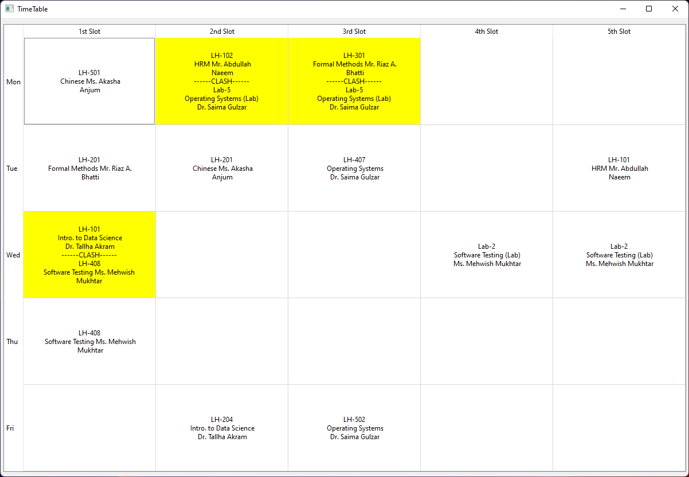

# CUI-Clash-Resolver
Timetable Clash resolver for CUI Wah CS Dept (For now)
- Note: Its a clash viewer, resolver will be implemented in future updates

CLI:
1. Put timetable.pdf in the same folder
2. Run the script
3. Select your registered courses
4. See your timetable and clashes

GUI:
1. Just run main_gui.py

### Screenshots:

## TODO
Clash resolver for:
- [ ] Electrical Engineering (Undergraduate)
- [ ] Management Sciences
- [ ] Civil Engineering
- [ ] Mechanical Engineering
- [ ] Clash resolver show suggestions for alternate course section with less or no clashes.
